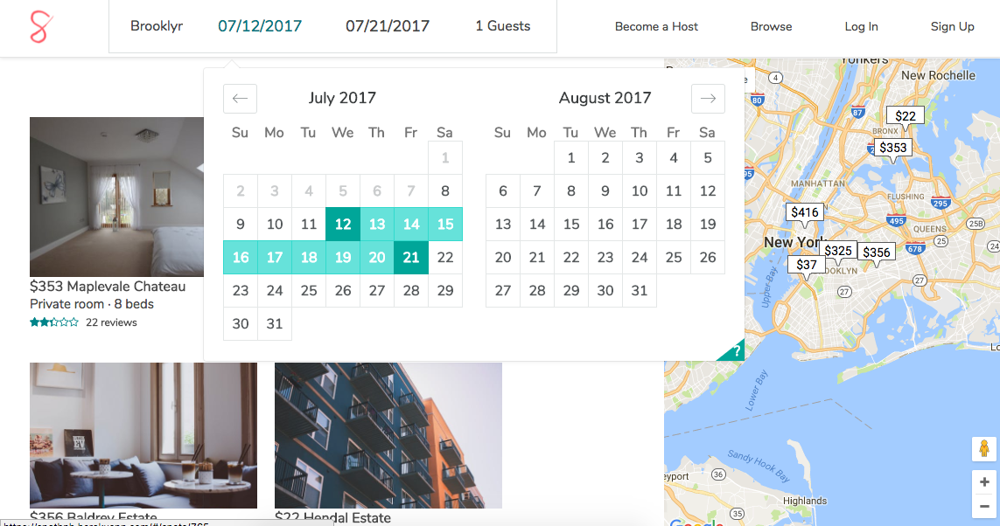

# SpotBnb

SpotBnb is a single page web application inspired by Airbnb. It was designed to help people make money by renting out their unused space. The app's API was built using Ruby on Rails. The front-end is made entirely of React components using Redux and the uni-directional flux pattern.

SpotBnb [live link][heroku]

[heroku]: http://spotbnb.herokuapp.com

## Features
Users can:

- [ ] Sign up or log in  or use a guest login to get a feel for the site.
- [ ] List their available 'Spots' Using an intuitive multi-step form
- [ ] Search for spots by location, availability and accommodation
- [ ] Book a spot with an easy to use calendar showing the unavailable dates disabled and clearly greyed out.
- [ ] View and control their booked trips.
- [ ] leave reviews with a rating score for their booked spots to improve search priority.



## Techical details
- [ ] Picture uploads handled by paperclip and stored remotely on AWS for faster load time.
- [ ] Basic custom implementation of back and front end auth.
- [ ] All search parameters are persisted within the redux store to allow for multi-filter searches.
- [ ] Location search parameters are parsed to check and correct for bounds that cross the date line.
```ruby
  def self.split?(bounds)
    bounds[:northEast][:lng].to_f < bounds[:southWest][:lng].to_f
  end

  def self.both_sides(bounds, spots)
    west_bounds = {
      southWest: bounds[:southWest],
      northEast: { lat: bounds[:northEast][:lat], lng: '179.999' }
    }
    east_bounds = {
      southWest: { lat: bounds[:southWest][:lat], lng: '-179.999' },
      northEast: bounds[:northEast]
    }
    spots.by_bounds(west_bounds, spots).union(spots.by_bounds(east_bounds, spots))
  end
```
- [ ] A custom SQL query gets the rating data for all search results to avoid N+1 queries and allow for scalability.

### Todo
- [ ] Users/Host profiles
- [ ] Realtime messaging
- [ ] Multiple sessions
